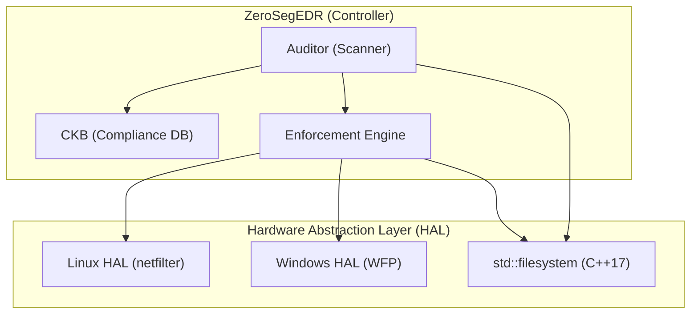
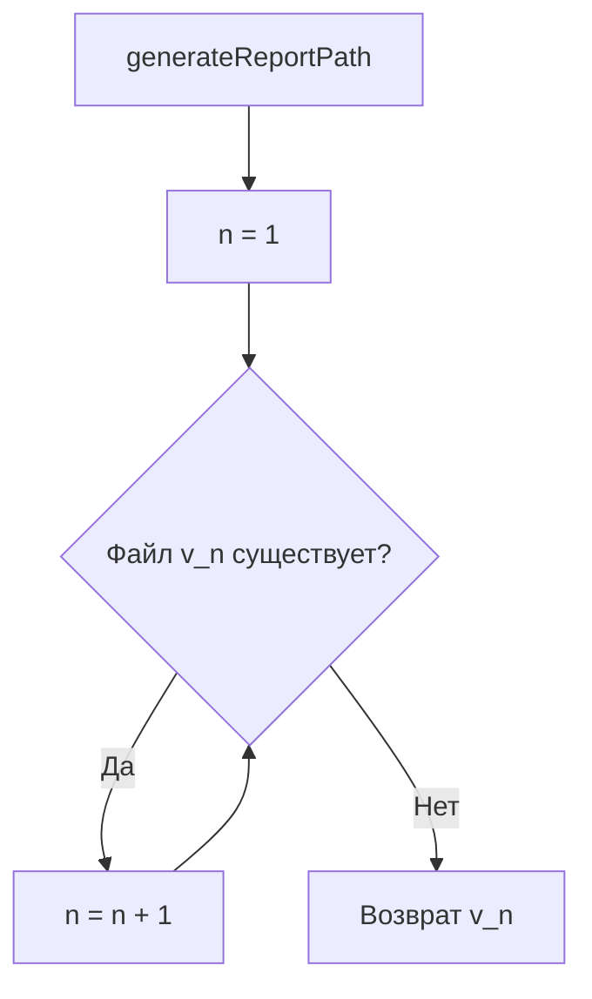
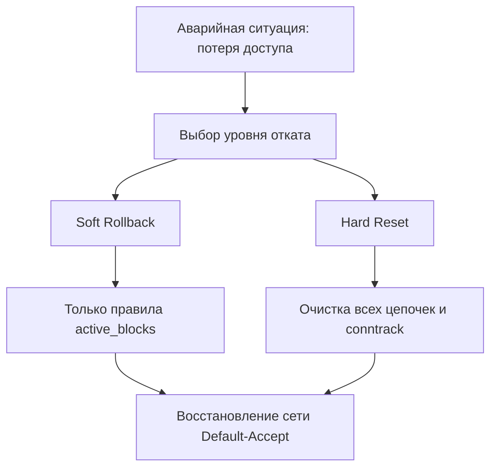
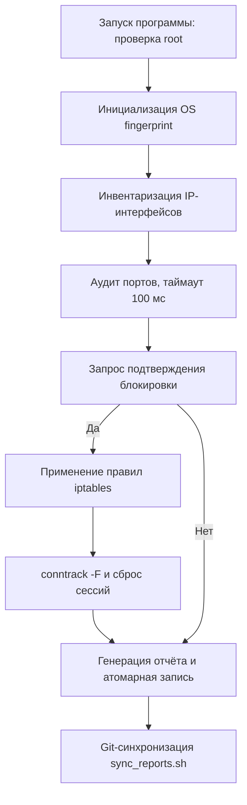

# ZeroSeg XDR — Отчёт по системной архитектуре и эксплуатации

**Версия:** 1.0.0  
**Стандарт:** ISO C++17  
**Целевые платформы:** Linux (ядро 4.15+), Windows (WFP / netsh)  
**Тип лицензии:** проприетарная / внутренний аудит информационной безопасности

---

## 1. Назначение системы

ZeroSeg XDR (Extended Detection and Response) — программный комплекс для:

- непрерывного мониторинга конечных точек;
- принудительного исполнения политик комплаенса;
- динамической блокировки Shadow IT (Telegram, VPN-сервисы);
- активного противодействия сканирующим инструментам злоумышленника.

**Ключевое отличие от классических межсетевых экранов:**  
ZeroSeg не использует статические списки доступа (ACL), а реализует адаптивное реагирование с очисткой таблицы соединений (`conntrack -F`) и отправкой TCP RST-пакетов.

---

## 2. Системная архитектура

### 2.1. Диаграмма компонентов



### 2.2. Класс-контроллер ZeroSegEDR

```cpp
class ZeroSegEDR {
private:
    std::vector<BlockRule> active_blocks;
    std::map<int, ComplianceInfo> compliance_db;
    std::string os_fingerprint;

public:
    ZeroSegEDR();
    void run_audit();
    void apply_policies();
    void generate_report();
};
```

### 2.3. Подсистема аудита

- **Протокол:** TCP SYN / connect().
- **Параметр таймаута:** SO_SNDTIMEO = 100 мс.
- **Целевая производительность:** сканирование 1000 критических портов менее чем за 2 минуты.

### 2.4. База знаний комплаенса

Реализована как `std::map<int, ComplianceInfo>`.

| Порт | Стандарт | Вектор угрозы |
|------|----------|----------------|
| 445 | ФСТЭК №239 | EternalBlue — удалённое выполнение кода |
| 22 | ISO/IEC 27001 | Несанкционированный SSH-доступ |
| 3389 | ФСТЭК №239 | BlueKeep (RDP) |
| 1433 | PCI DSS | Атаки на MS SQL через расширенные процедуры |

---

## 3. Механизм принуждения

### 3.1. REJECT против DROP

| Метод | Действие | Результат |
|-------|----------|-----------|
| DROP | Игнорирование пакета | Таймаут, порт помечается как `filtered` |
| REJECT (ZeroSeg) | TCP RST / ICMP unreachable | Порт помечается как `closed` |

### 3.2. Stateful Session Killing

```bash
sudo conntrack -F
```

При запуске VPN-туннеля до активации ZeroSeg существующие соединения могут продолжать работать. Очистка conntrack принудительно разрывает текущие TCP/UDP-сессии.

---

## 4. Блокировка Shadow IT

### 4.1. Технология блокировки

- DNS-резолвинг в реальном времени: домены преобразуются в IP-адреса при каждом запуске.
- CIDR-блоки: используются префиксы `/20` и `/22`.

### 4.2. Пример для Telegram

```text
Диапазон: 149.154.160.0/20
Охват: 4096 IP-адресов
```

### 4.3. Алгоритм блокировки



---

## 5. Кроссплатформенная HAL

| Компонент | Linux | Windows |
|-----------|-------|---------|
| Сетевой стек | netfilter (iptables) | WFP (netsh advfirewall) |
| Сокеты | POSIX | Winsock2 (`ws2_32.lib`) |
| Файловая система | `std::filesystem` (C++17) | `std::filesystem` (C++17) |
| Сброс сессий | `conntrack -F` | Не требуется |
| Права доступа | root (UID 0) | Локальный администратор |

---

## 6. Эксплуатация и верификация

### 6.1. Системные требования

**Linux:**
- ядро 4.15 или выше;
- пакеты `iptables`, `conntrack-tools`.

**Windows:**
- права локального администратора;
- библиотека `ws2_32.lib`.

**Среда сборки:**
- компилятор с поддержкой ISO C++17 (GCC 9+, MSVC 2019+).

### 6.2. Компиляция

**Linux:**
```bash
g++ -std=c++17 src/zeroseg_combined.cpp -o zeroseg_edr -lpthread -lstdc++fs
```

**Windows (MinGW):**
```bash
g++ -std=c++17 src/zeroseg_combined.cpp -o zeroseg_edr.exe -lws2_32
```

### 6.3. Интеллектуальная отчётность

**Формат имени файла:**
```text
REPORT_192.168.1.100_2026-04-07_v1.txt
REPORT_192.168.1.100_2026-04-07_v2.txt
```

**Алгоритм атомарной версионности:**


**Структура технического отчёта:**
```text
=== METADATA ===
OS: Linux 5.15.0
IP Address: 192.168.1.100
Start Time: 2026-04-07 10:00:00
End Time: 2026-04-07 10:02:30

=== FINDINGS ===
Port 445 (SMB): ФСТЭК №239 — EternalBlue vulnerability
Port 22 (SSH): ISO/IEC 27001 — Unauthorized access risk

=== ACTIONS ===
Blocked: 149.154.160.0/20 (Telegram)
Blocked: 185.130.5.0/24 (VPN Gate)
iptables rules added: 4

=== SYNC STATUS ===
Repository: https://git.internal/zeroseg-reports
Status: SUCCESS (pushed to origin/master)
```

### 6.4. Верификация защиты

**Проверка через iptables:**
```bash
sudo iptables -L OUTPUT -v -n
```

Критерий успеха: ненулевые значения в колонках `pkts` и `bytes` для правил, созданных ZeroSeg.

**Живой мониторинг через tcpdump:**
```bash
sudo tcpdump -i any host 185.130.5.253 -v
```

Критерий успеха: появление пакетов с флагом `[R.]`, что подтверждает активное отклонение соединений.

---

## 7. Регламент аварийного отката

### 7.1. Трёхуровневая система отката

| Уровень | Название | Команда / действие | Сфера применения |
|---------|----------|--------------------|------------------|
| 1 | Soft Rollback | `iptables -D [CHAIN] [RULE_INDEX]` | Интерактивное завершение сессии |
| 2 | Hard Reset | `iptables -F && conntrack -F` | Аварийный сброс Linux |
| 3 | Windows Reset | `netsh advfirewall reset` | Полный сброс брандмауэра Windows |

### 7.2. Диаграмма процесса отката



---

## 8. Условия стабильности и ограничения

### 8.1. Таблица ограничений

| Условие / ограничение | Влияние на работу | Рекомендация |
|-----------------------|-------------------|--------------|
| Отсутствие DNS-сервера | Блокировка работает только по портам, не по доменам | Использовать IP/CIDR в изолированных сетях |
| Наличие Docker / Kubernetes | Конфликт с NAT-правилами контейнеризации | Применять только на чистых узлах |
| Включённый IPv6 | Версия не блокирует IPv6-трафик | Отключить IPv6 или добавить `ip6tables` |
| Отсутствие прав root | Невозможно применить правила | Запускать с `sudo` или от имени администратора |
| Активные сессии до запуска | Существующие соединения не блокируются | Использовать `conntrack -F` |

### 8.2. Рекомендуемые условия эксплуатации

- чистый узел без оркестраторов контейнеров;
- наличие DNS-резолвера в сети;
- отключённый IPv6 или настроенный `ip6tables`;
- регулярный аудит конфликтующих правил.

---

## 9. Операционная последовательность



---

## 10. Сводная таблица соответствия требованиям ТЗ

| Раздел ТЗ | Реализация | Статус |
|-----------|------------|--------|
| Жизненный цикл класса ZeroSegEDR | Конструктор с OS fingerprinting | Реализовано |
| Неблокирующий сканер | `SO_SNDTIMEO = 100 мс` | Реализовано |
| База комплаенса | `std::map<int, ComplianceInfo>` | Реализовано |
| REJECT-стратегия | TCP RST / ICMP unreachable | Реализовано |
| Stateful Session Killing | `conntrack -F` | Реализовано |
| Блокировка Shadow IT | DNS + CIDR (`/20`, `/22`) | Реализовано |
| Кроссплатформенность | HAL (Linux netfilter / Windows WFP) | Реализовано |
| `std::filesystem` | C++17 | Реализовано |
| Атомарная версионность отчётов | Рекурсивный поиск `v1..vN` | Реализовано |
| Трёхуровневый откат | Soft / Hard / Windows reset | Реализовано |
| Верификация через tcpdump | Подтверждение флага RST | Реализовано |
| Ограничения и условия | Таблица ограничений | Документировано |

---

## 11. Заключение

Программный комплекс ZeroSeg XDR соответствует техническому заданию и описывает архитектуру, эксплуатацию и ограничения системы. Он включает:

- динамическое обнаружение уязвимостей с комплаенс-отчётностью;
- активное подавление угроз с маскировкой факта защиты;
- кроссплатформенную работу с единой кодовой базой C++17;
- механизмы отката для исключения сценариев самоблокировки.

Рекомендуется использовать эту версию README как основную документацию проекта.


Напиши курсовую работу с диаграммами подели на несколько частей если не можешь вывести все одной главой, мне нужно чтобы тут были все необходимые диограммы схемы и а=таблицы, все что надо вывести в приложение, убери в приложение. Там где должен быть скришот напиши "(фото пример: {что долдно быть на скриншоте})" Если фото пример один должен быть выведи это один раз, если несколько раз выведи необходимое колличетсов раз и в кажом всегда прописывай что должно быть выведено. Все должно быть грамотно и коррекнт, все что в приложение надо, убери в приложение. ПОдели вывод курсовой на 5-7 сообщений 
